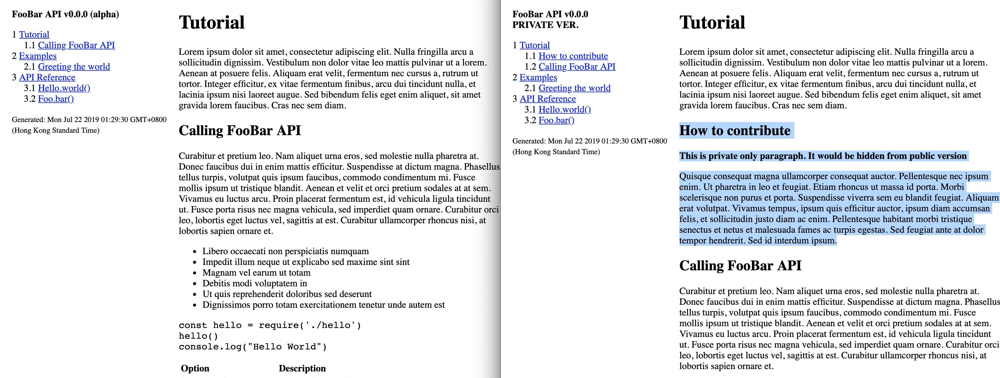

# Quick-and-dirty
HTML page generation from [Mustache](https://mustache.github.io/)/[Markdown](https://github.com/markdown-it/markdown-it) template

## How it works
`Template files + Mustache payloads --> Mustache processor --> Markdown processor --> HTML files`  
Autogen mode is avaliable to regenerate HTML files on the fly.  
[TOC](https://github.com/nagaozen/markdown-it-toc-done-right) could be autogenerated and placed via `[toc]` string.

## Why?
Quick-and-dirty original purpose is to quickly generate Markdown based documentation. E.g. if multiple versions of docs need to be created from the same source e.g. production and sandbox ver., public and internal.

# Example
Check `example/preset.json` in example directory.  
Result is stored in `example/public`. Some parts of `example/public/internal.html` were removed in "public" version.



Each version is based on its own Mustache JSON payload:
```
index.md + index.json   = index.html
index.md + private.json = private.html
```

## Script

Usage format:
```
node index.js PATH [AUTOGEN]
```

Argument | Description                                                                        | Default
---------|------------------------------------------------------------------------------------|--------------
PATH     | Preset JSON payload                                                                | N/A
AUTOGEN  | Controls if OUTPUT must be regenerated on TEMPLATE or PAYLOAD change (true\|false) | false